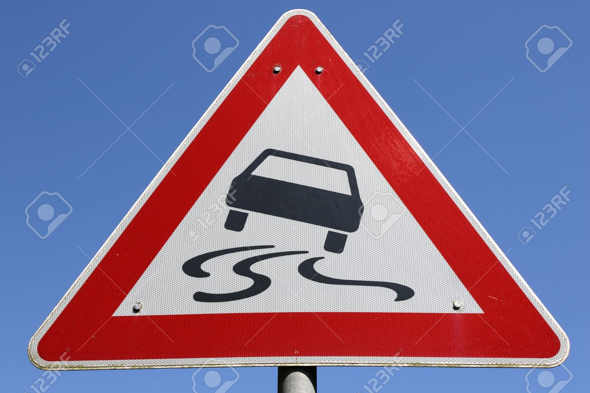

# **Traffic Sign Recognition**

## Writeup

---

**Build a Traffic Sign Recognition Project**

The goals / steps of this project are the following:
* Load the data set (see below for links to the project data set)
* Explore, summarize and visualize the data set
* Design, train and test a model architecture
* Use the model to make predictions on new images
* Analyze the softmax probabilities of the new images
* Summarize the results with a written report

[//]: # (Image References)

[image1]: ./images/training_counts.png "Training Label Counts"
[image2]: ./images/validation_counts.png "Validation Label Counts"
[image3]: ./images/test_counts.png "Test Label Counts"
[image4]: ./images/training_samples.png "Training Samples"
[image5]: ./images/validation_samples.png "Validation Samples"
[image6]: ./images/test_samples.png "Test Samples"
[image7]: ./images/training_quantile_transformed_samples.png "Normalized Training Samples"
[image8]: ./images/traffic1.jpg "Traffic Sign 1"
[image9]: ./images/traffic2.jpg "Traffic Sign 2"
[image10]: ./images/traffic3.jpg "Traffic Sign 3"
[image11]: ./images/traffic4.jpg "Traffic Sign 4"
[image12]: ./images/traffic5.jpg "Traffic Sign 5"
[image13]: ./images/traffic6.jpg "Traffic Sign 6"

## Rubric Points
### Here I will consider the
[rubric points](https://review.udacity.com/#!/rubrics/481/view) individually
and describe how I addressed each point in my implementation.  

---
### Writeup / README

#### 1. Provide a Writeup / README that includes all the rubric points and
how you addressed each one. You can submit your writeup as markdown or pdf.
You can use this template as a guide for writing the report.
The submission includes the project code.

You're reading it! and here is a link to my [project code](https://github.com/itprov/CarND-Traffic-Sign-Classifier-Project/blob/master/Traffic_Sign_Classifier.ipynb)

### Data Set Summary & Exploration

#### 1. Provide a basic summary of the data set. In the code, the analysis
should be done using python, numpy and/or pandas methods rather than hardcoding
results manually.

I used the pandas library to calculate summary statistics of the traffic
signs data set:

* The size of training set is 34799
* The size of the validation set is 4410
* The size of test set is 12630
* The shape of a traffic sign image is (32, 32, 3)
* The number of unique classes/labels in the data set is 43

#### 2. Include an exploratory visualization of the dataset.

Here is an exploratory visualization of the data set.
##### A. Bar charts showing counts of labels belonging to each class,
in Training, Validation, and Test datasets

![Training Label Counts][image1]
![Validation Label Counts][image2]
![Test Label Counts][image3]

##### B. Random samples selected from Training, Validation, and Test datasets

![Training Samples][image4]
![Validation Samples][image5]
![Test Samples][image6]

### Design and Test a Model Architecture

#### 1. Describe how you preprocessed the image data. What techniques were chosen and why did you choose these techniques? Consider including images showing the output of each preprocessing technique. Pre-processing refers to techniques such as converting to grayscale, normalization, etc. (OPTIONAL: As described in the "Stand Out Suggestions" part of the rubric, if you generated additional data for training, describe why you decided to generate additional data, how you generated the data, and provide example images of the additional data. Then describe the characteristics of the augmented training set like number of images in the set, number of images for each class, etc.)

Initially, I tried the simple normalization technique (X - 128 / 128). After experimenting, I found that normalizing / scaling API from the sklearn library provided better results. I experimented with various preprocessing classes from the sklearn library
like Normalizer, StandardScaler, QuantileTransformer, and found that QuantileTransformer gives better model performance than all others, due to its ability to distribute the dataset uniformly.

The images look like this after normalizing.

![Normalized Training Samples][image7]

#### 2. Describe what your final model architecture looks like including model type, layers, layer sizes, connectivity, etc.) Consider including a diagram and/or table describing the final model.

I have used the slightly higher level tf.layers API instead of tf.nn. My final model consists of the following layers:

| Layer         		|     Description	        					|
|:---------------------:|:---------------------------------------------:|
| Input         		| 32x32x3 RGB image   							|
| Convolution 5x5 + RELU| 1x1 stride, valid padding, outputs 28x28x16 	|
| Max pooling  			| 2x2 pool, 2x2 stride,  outputs 14x14x16 		|
| Dropout      			| Dropout rate = 50%  							|
| Convolution 5x5 + RELU| 1x1 stride, valid padding, outputs 10x10x32 	|
| Max pooling  			| 2x2 pool, 1x1 stride,  outputs 9x9x32 		|
| Dropout      			| Dropout rate = 50%  							|
| Convolution 3x3 + RELU| 1x1 stride, valid padding, outputs 7x7x64 	|
| Max pooling  			| 2x2 pool, 1x1 stride,  outputs 6x6x64 		|
| Dropout      			| Dropout rate = 50%  							|
| Convolution 3x3 + RELU| 1x1 stride, valid padding, outputs 4x4x128 	|
| Max pooling  			| 2x2 pool, 1x1 stride,  outputs 3x3x128 		|
| Flattened    			| outputs 768. 									|
| Dropout      			| Dropout rate = 50%  							|
| Fully connected		| outputs 256.        							|
| Fully connected		| outputs 64.        							|
| Dropout      			| Dropout rate = 50%  							|
| Softmax				| outputs 43.        							|
|						|												|

#### 3. Describe how you trained your model. The discussion can include the type of optimizer, the batch size, number of epochs and any hyperparameters such as learning rate.

To train the model, I used the Adam optimizer to find the weights and bias corresponding to minimum loss. I kept the values such as β1, β2, etc. same as default, but experimented with various learning rate α, such as 0.0009, 0.001, 0.002, 0.0015, etc.. I also experimented with various values of epochs = 10, 15, 20, 30, etc., and batch size = 64, 80, 100, 128, etc. 

#### 4. Describe the approach taken for finding a solution and getting the validation set accuracy to be at least 0.93. Include in the discussion the results on the training, validation and test sets and where in the code these were calculated. Your approach may have been an iterative process, in which case, outline the steps you took to get to the final solution and why you chose those steps. Perhaps your solution involved an already well known implementation or architecture. In this case, discuss why you think the architecture is suitable for the current problem.

My final model results were:
* training set accuracy of 99.9%
* validation set accuracy of 97.8% (at epoch = 28)
* test set accuracy of 94.8%

Initially, I tried the LeNet architecture, but got only up to 92% validation set accuracy. Therefore, I started experimenting by adding more convolutional & pooling layers and changing the number of filters, kernel size, pool size, and strides. One architecture did give me 98.7% of validation set accuracy, but its performance on the New Images was poorer than the final model. Also, the training data set accuracy was ~5% higher than validation data set accuracy. Therefore, I experimented with adding few dropout regularization layers to reduce overfitting. The result was reduction of the difference between training and validation data set accuracies. 

However, still there is a difference of ~3% between training and validation data set accuracies, so more work is needed to reduce further reduce overfitting. Augmenting the data set with images synthesized from the existing training data set will help. 

Parameters tuned:
* Learning rate α - tried 0.0009, 0.0015, 0.002, before settling on 0.001 
* Number of epochs - tried 10, 15, 20, before settling on 30
* Batch size - tried 128, 80, 64, before settling on 100

How selected layers help achieve the outcome: Convolutional layers work well with this model because each layer detects features from the images that are useful in detecting the class of the image (traffic sign). As the number of filters is selected to be increasing from initial to final layers, the features detected include initially detected high level features such as presence of vertical / horizontal / slanted lines, to more specific features such as presence of numbers / shapes such as humans, vehicles in later layers. Dropout layers prevent overfitting as a certain percentage of neurons are randomly deactivated in every batch, so none of the neurons are relied upon excessively. 

### Test a Model on New Images

#### 1. Choose five German traffic signs found on the web and provide them in the report. For each image, discuss what quality or qualities might be difficult to classify.

Here are six German traffic signs that I found on the web:

I resized them to 32x32 and preprocessed them with the same quantile transformer. 

Qualities that might be difficult to classify for these images:
* First image: similarity of the sign with human form. 
* Second image: curvy lines that could be difficult to detect. Also, relatively lower number of training samples. 
* The rest of the images (3 - 6) look very straightforward to classify. 

#### 2. Discuss the model's predictions on these new traffic signs and compare the results to predicting on the test set. At a minimum, discuss what the predictions were, the accuracy on these new predictions, and compare the accuracy to the accuracy on the test set (OPTIONAL: Discuss the results in more detail as described in the "Stand Out Suggestions" part of the rubric).

Here are the results of the prediction:

| Image			                        |     Prediction	        				|
|:-------------------------------------:|:-----------------------------------------:|
| Right-of-way at the next intersection | Right-of-way at the next intersection		|
| Slippery road  						| Slippery road  							|
| No entry       						| No entry 									|
| Right turn ahead  					| Right turn ahead 				 			|
| 30 km/h        						| 30 km/h  						 			|
| Stop Sign     						| Stop Sign   		 						|

The model was able to correctly identify all of the 6 traffic signs, which gives an accuracy of 100%. This compares favorably to the accuracy on the test set of 94.8%. 

#### 3. Describe how certain the model is when predicting on each of the five new images by looking at the softmax probabilities for each prediction. Provide the top 5 softmax probabilities for each image along with the sign type of each probability. (OPTIONAL: as described in the "Stand Out Suggestions" part of the rubric, visualizations can also be provided such as bar charts)

The code for making predictions on my final model is located under the heading "Predict the Sign Type for Each Image" in the Jupyter notebook.

For each image, the model is close to 100% sure (probability of 1.0) of the predicted class, as indicated in the table above. The top five soft max probabilities for each image were:

Image 1:

| Probability         	|     Prediction	        					|
|:---------------------:|:---------------------------------------------:|
| 1.0         			| Right-of-way at the next intersection			|
| ~.0     				| Speed limit (100km/h)							|
| ~.0					| Pedestrians 									|
| ~.0					| End of speed limit (80km/h)	 				|
| ~.0					| Speed limit (30km/h)   						|

Image 2:

| Probability         	|     Prediction	        					|
|:---------------------:|:---------------------------------------------:|
| 1.0         			| Slippery road 								|
| ~.0     				| No passing 									|
| ~.0					| Dangerous curve to the left					|
| ~.0					| Children crossing				 				|
| ~.0					| Bicycles crossing 							|

Image 3:

| Probability         	|     Prediction	        					|
|:---------------------:|:---------------------------------------------:|
| 1.0         			| No entry   									|
| ~.0     				| Ahead only									|
| ~.0					| Traffic signals								|
| ~.0					| End of no passing					 			|
| ~.0					| Road work 									|

Image 4:

| Probability         	|     Prediction	        					|
|:---------------------:|:---------------------------------------------:|
| ~1.0         			| Right turn ahead   							|
| ~.0     				| Keep right									|
| ~.0					| Ahead only 									|
| ~.0					| Roundabout mandatory			 				|
| ~.0					| Keep left    	 	 							|

Image 5:

| Probability         	|     Prediction	        					|
|:---------------------:|:---------------------------------------------:|
| 1.0         			| Speed limit (30km/h)   						|
| ~.0     				| Speed limit (60km/h) 							|
| ~.0					| Speed limit (20km/h) 							|
| ~.0					| Speed limit (50km/h) 				 			|
| ~.0					| Roundabout mandatory 							|

Image 6:

| Probability         	|     Prediction	        					|
|:---------------------:|:---------------------------------------------:|
| 1.0         			| Stop sign   									|
| ~.0     				| No entry										|
| ~.0					| Speed limit (20km/h)							|
| ~.0					| Speed limit (60km/h)			 				|
| ~.0					| Right-of-way at the next intersection			|

### (Optional) Visualizing the Neural Network (See Step 4 of the Ipython notebook for more details)
#### 1. Discuss the visual output of your trained network's feature maps. What characteristics did the neural network use to make classifications?
